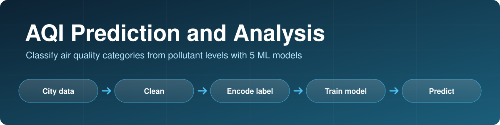
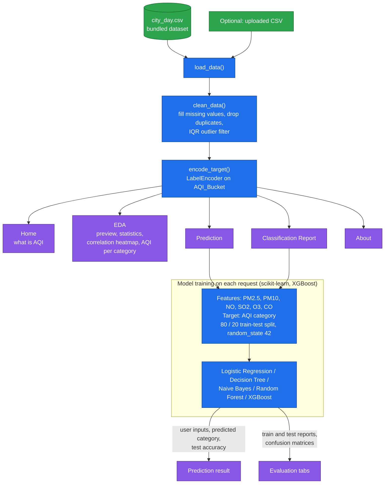

<p align="center">
  
</p>

<p align="center">
  
  
  
  
  
</p>

# AQI Prediction and Analysis

**A Streamlit app that explores city-level air quality data and predicts the Air Quality Index (AQI) category, such as Good, Satisfactory or Poor, from six pollutant readings using five machine learning models.**

You can browse the data, compare Logistic Regression, Decision Tree, Naive Bayes, Random Forest and XGBoost, enter your own pollutant levels to get a predicted category, and inspect each model's classification report and confusion matrix on training and test data.

---

## Key features

- **Five-page app**: Home, EDA, Prediction, Classification Report and About.
- **Exploratory analysis**: data preview, summary statistics, a correlation heatmap of the pollutants and AQI, and average AQI per category.
- **Five classifiers to compare**: Logistic Regression, Decision Tree, Naive Bayes, Random Forest and XGBoost.
- **Interactive prediction**: set PM2.5, PM10, NO, SO2, O3 and CO (pre-filled with dataset means), pick a model, and get the predicted AQI category with the model's test accuracy.
- **Model evaluation**: per-class precision, recall and F1, plus confusion matrices for the training and the testing split.
- **Bring your own data**: upload a CSV with the same columns to replace the bundled dataset.

---

## Architecture



### Data

`city_day.csv` contains 29,531 daily readings for 26 cities from 2015-01-01 to 2020-07-01, with these columns: `City`, `Date`, `PM2.5`, `PM10`, `NO`, `NO2`, `NOx`, `NH3`, `CO`, `SO2`, `O3`, `Benzene`, `Toluene`, `Xylene`, `AQI`, `AQI_Bucket`. The model uses six of them (`PM2.5`, `PM10`, `NO`, `SO2`, `O3`, `CO`) to predict `AQI_Bucket`.

### Data cleaning (in `clean_data`)

1. Missing numeric values are replaced with the column mean, and missing categorical values with the most frequent value.
2. Duplicate rows are dropped.
3. Rows outside 1.5 x IQR of any numeric column are removed.

---

## Results

Measured by running the app's own cleaning and evaluation code (80 / 20 split, `random_state=42`) on the bundled dataset. The Decision Tree is not seeded in the app, so its numbers vary slightly between runs.

| Model | Test accuracy | Train accuracy |
|---|---|---|
| Logistic Regression | 0.780 | 0.780 |
| Decision Tree | 0.758 | 0.997 |
| Naive Bayes | 0.781 | 0.786 |
| Random Forest | 0.826 | 0.997 |
| XGBoost | 0.821 | 0.967 |

After cleaning, 13,236 of the 29,531 rows remain (10,588 for training and 2,648 for testing).

How to read these numbers:
- The AQI category is derived from the AQI value, which is itself computed from pollutant concentrations, so predicting it from pollutants is close to a lookup. These accuracies show how well each model recovers that relationship, not forecasting skill.
- The tree-based models fit the training data almost perfectly (0.97 to 0.997), so their test accuracy is the more meaningful number.

---

## Project structure

```
AQI/
├── application.py      # the Streamlit app (data cleaning, pages, models)
├── city_day.csv        # dataset
├── requirements.txt
└── docs/banner.svg
```

## Setup and usage

```bash
git clone https://github.com/talha142/AQI.git
cd AQI

python -m venv venv
source venv/bin/activate          # Windows: venv\Scripts\activate
pip install -r requirements.txt

streamlit run application.py
```

Run it from the project folder, because the app reads `city_day.csv` from the current directory. Use the sidebar to switch pages or upload your own CSV.

---

## Limitations

- **The cleaning step removes most of the data.** Outlier removal on every numeric column drops 55% of the rows (29,531 to 13,236). It also removes all of the "Severe" days and nearly all "Very Poor" ones (Very Poor drops from 2,337 rows to 28, Poor from 2,781 to 515), so the app can never predict "Severe" and rarely predicts the worst categories, which are the ones that matter most.
- **Missing labels are filled with the most frequent category.** 4,681 rows have no AQI or category, and the category is imputed with the mode ("Moderate"), which adds label noise.
- Models are trained inside the app on every button click or page load, with a single train-test split and no cross-validation or hyperparameter tuning.
- The task is close to a deterministic mapping (see Results), so the app is better described as a demonstration of a classification workflow than as an air-quality forecast.
- No automated tests.

## Future improvements

- Handle outliers and missing values in a way that keeps the high-pollution days, and evaluate per-class metrics on the rare categories.
- Predict the numeric AQI as a regression, or forecast future values from time-series features (date, city, previous days).
- Train models once, cache or save them, and add cross-validation.
- Add a screenshot or short demo GIF of the app.
